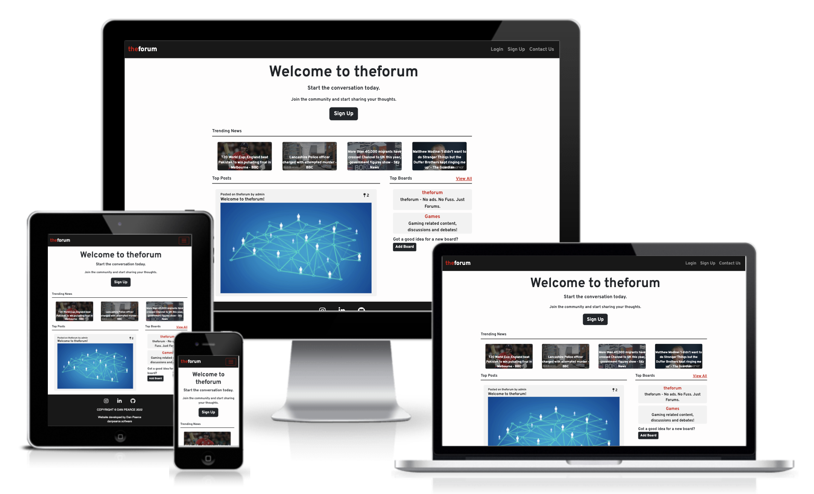

# theforum - No ads. No Fuss. Just Forums.
Developed by, [Dan Pearce](https://danpearce.software/)

[View the live application](https://ci-pp4-theforum-danpearce.herokuapp.com/)

theforum is exacty what it says it is on the tin, a website designed for any and whatever topics our users would like to discuss! The site is deliberately left as a broad discussion board, to attract just about anyone who has something to say.

Users are able to create their own ForumPost, comment on any post, and create their own ForumBoard. This allows the users to have a free discussion on their chosen topic. 

"theforum - No ads. No Fuss. Just Forums."

## Contents
1. [Application Goals and User Experience](#application-goals-and-user-experience)
    - [User Goals](#user-goals)
    - [Owner Goals](#owner-goals)
    - [Target Audience](#target-audience)
    - [User Expectations](#user-expectations)
    - [User Manual](#user-manual)
2. [User Stories](#user-stories)
    - [User](#user)
    - [Owner](#owner)
3. [Design](#design)
    - [Structure](#structure)
    - [Database and Models](#database-and-models)
    - [Technical Design](#technical-design)
    - [Colour](#colour)
4. [Main Features](#main-features)
5. [Technologies](#technologies)
    - [Languages](#languages)
    - [Libraries](#libraries)
    - [APIs](#apis)
    - [Frameworks and Other Technologies](#frameworks-and-other-technologies)
6. [Validation and Testing](#validation-and-testing)
    - [Python PEP8 Testing](#python-pep8-testing)
    - [HTML Validation](#html-validation)
    - [CSS Validation](#css-validation)
    - [Accessibility Validation](#accessibility-validation)
    - [Performance Validation](#performance-validation)
    - [Device and Browser Compatibility](#device-and-browser-compatibility)
    - [User Story Testing](#user-story-testing)
7. [Bugs and Errors](#bugs-and-errors)
8. [Deployment](#deployment)
9. [Credits](#credits)
10. [Acknowledgements](#acknowledgements)

## Application Goals and User Experience
### User Goals
### Owner Goals
### Target Audience
### User Expectations
### User Manual

## User Stories
### User
### Owner

## Design
### Structure
### Database and Models
### Technical Design
### Colour 

## Main Features

## Technologies
### Languages
### Libraries
### APIs
### Frameworks and Other Technologies

## Validation and Testing
### Python PEP8 Testing
### HTML Validation
### CSS Validation
### Accessibility Validation
### Performance Validation
### Device and Browser Compatibility
### User Story Testing

## Bugs and Errors

## Deployment

## Credits

## Acknowledgements