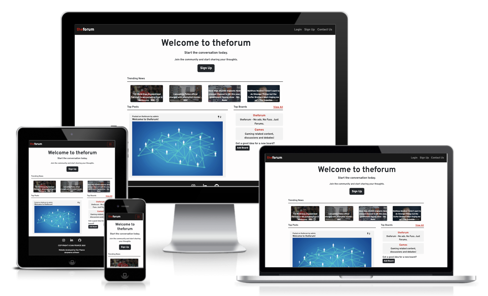
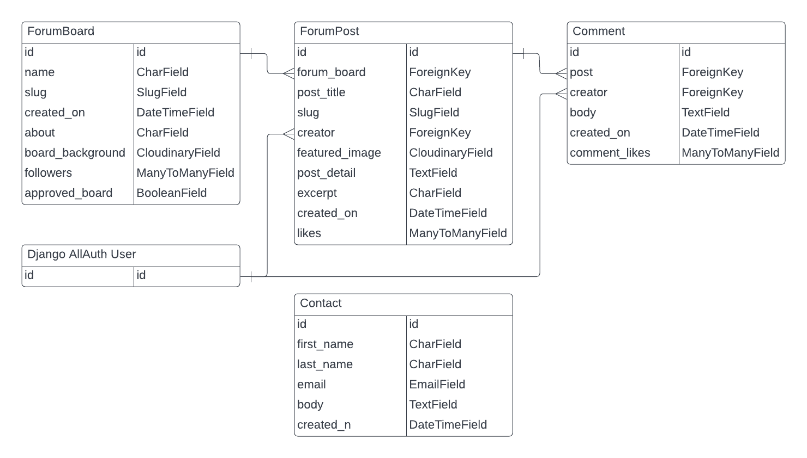
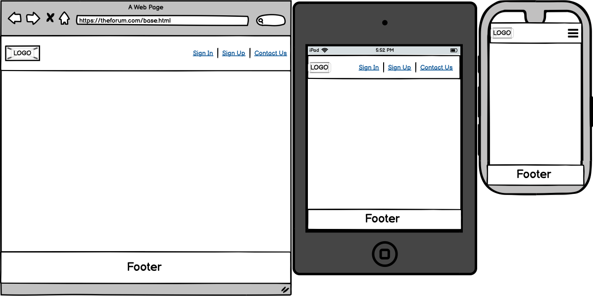
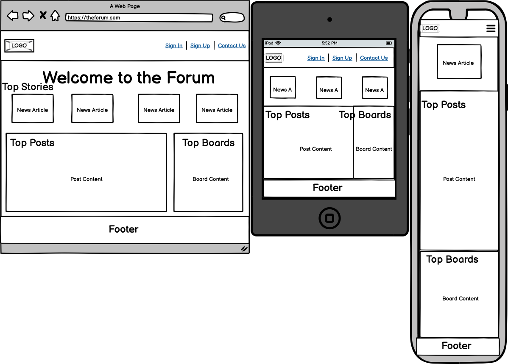
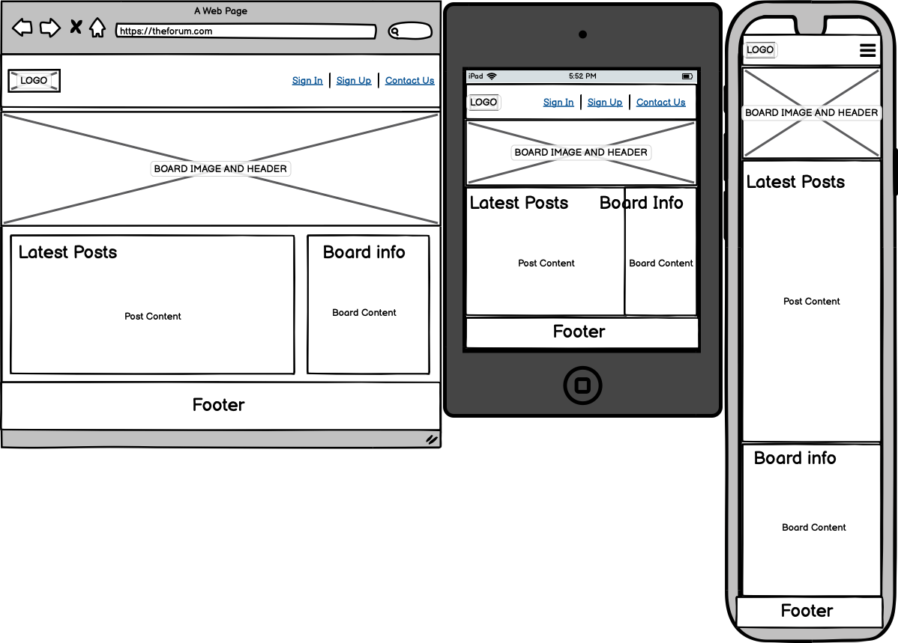
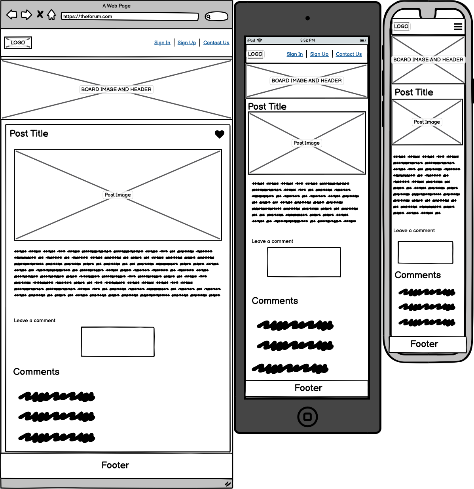
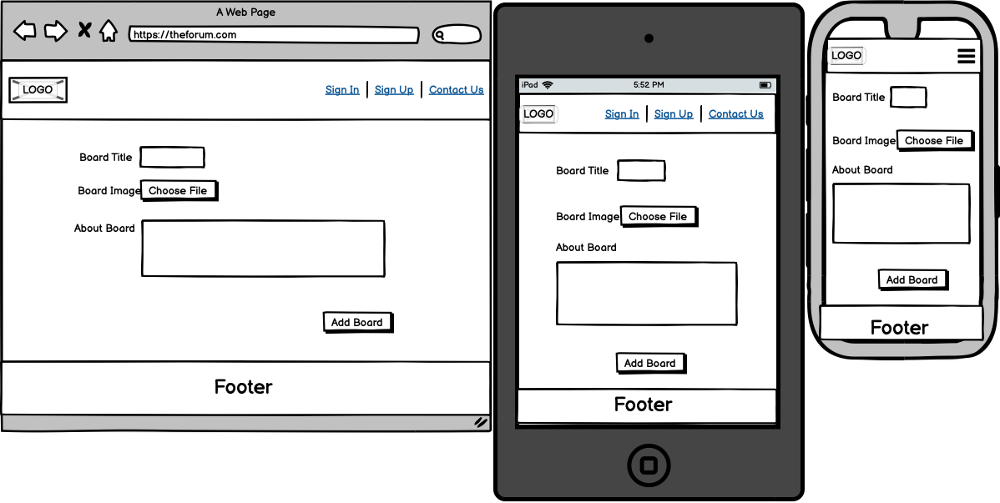
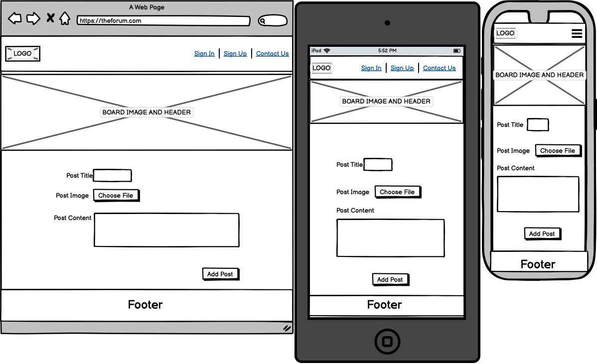

# theforum - No ads. No Fuss. Just Forums.
Developed by, [Dan Pearce](https://danpearce.software/)

[View the live application](https://ci-pp4-theforum-danpearce.herokuapp.com/)

theforum is exacty what it says it is on the tin, a website designed for any and whatever topics our users would like to discuss! The site is deliberately left as a broad discussion board, to attract just about anyone who has something to say.

Users are able to create their own ForumPost, comment on any post, and create their own ForumBoard. This allows the users to have a free discussion on their chosen topic. 

"theforum - No ads. No Fuss. Just Forums."

## Contents
1. [Application Goals and User Experience](#application-goals-and-user-experience)
    - [User Goals](#user-goals)
    - [Owner Goals](#owner-goals)
    - [Target Audience](#target-audience)
    - [User Expectations](#user-expectations)
    - [User Manual](#user-manual)
2. [User Stories](#user-stories)
    - [User](#user)
    - [Owner](#owner)
3. [Design](#design)
    - [Structure](#structure)
    - [Database and Models](#database-and-models)
    - [Wireframes](#wireframes)
    - [Colour](#colour)
4. [Main Features](#main-features)
5. [Technologies](#technologies)
    - [Languages](#languages)
    - [Libraries](#libraries)
    - [APIs](#apis)
    - [Frameworks and Other Technologies](#frameworks-and-other-technologies)
6. [Validation and Testing](#validation-and-testing)
    - [Python PEP8 Testing](#python-pep8-testing)
    - [HTML Validation](#html-validation)
    - [CSS Validation](#css-validation)
    - [Accessibility Validation](#accessibility-validation)
    - [Performance Validation](#performance-validation)
    - [Device and Browser Compatibility](#device-and-browser-compatibility)
    - [User Story Testing](#user-story-testing)
7. [Bugs and Errors](#bugs-and-errors)
8. [Deployment](#deployment)
9. [Credits](#credits)
10. [Acknowledgements](#acknowledgements)

## Application Goals and User Experience

### User Goals
- Easily navigate thoughout the website with ease.
- Easily distinguish if logged in, use the site in all states.
- Use theforum to create content and discussions.
- Get in touch with the administrative team, regarding reporting a post or anything else.

### Owner Goals
- Provide the user feedback while using the site.
- Provide the user and experience that is responsive.
- Provide the user with a point of contact for submitting a report or getting in touch in general.

### Target Audience
- Lovers of debates/conversations about any topic they wish to talk about.
- Users that would like to catch up on the latest news.
- People who like to voice their opinion.

### User Expectations
- Experience use of the site on all devices, with a fully responsive experience.
- While navigating throughout the site, always able to understand where they are and how to get back.
- An interactive and engaging user interface that is easy to use.
- All links to be fully functioning and working throughout the site.

## User Stories
### User
1. Trending Home Page
    - As a Consumer I can view a list of trending posts so that I can select the one I’d prefer to read.
2. Categorisation of Posts
    - As a Consumer, I can view, and navigate through different Forum Boards and posts, so that I can find the topics/hobbies that I’d like to read.
3. Likes on a Post
    - As a Consumer, I can view the number of likes a post has received, so that I can clearly see which post is the most popular.
4. Opening a Post
    - As a Consumer, I can open a post so that I can read its contents.
5. Viewing Comments
    - As a Consumer, I can see the comments on a post, so that I can gather other’s opinions on the topic. 
6. Account Creation
    - As a Consumer, I can create an account, so that I can use more features of the site.
7. Liking of Posts
    - As a Consumer I can like existing posts, so that I can help to increase its popularity/trending status.
8. Editing Posts
    - As a Consumer, I can make changes to my existing posts, so that I can rectify any errors I may have made while creating the original post.
9. Deleting Posts
    - As a Consumer, I can delete any of my existing posts, so that I can chose to take said post down for whatever reason.
10. Creating a Board
    - As a Consumer, I can create a Forum Board, so that I can create a sub-community for said topic/hobby.
11. Following Boards
    - As a Consumer, I can follow a Forum Board, so that I can help to increase its popularity/trending status.
12. Creating a Post
    - As a Consumer, I can create a post, so that I can engage and start a conversation with my chosen Forum Board.
13. Commenting on Posts
    - As a Consumer, I can comment on existing posts, so that I can add my input to an existing post/conversation.
14. Reporting Posts
    - As a Consumer, I can report a post, so that I can help to keep the community a safe place.
15. Contact Us
    - As a Consumer, I can get in touch with the administrative team, so that I can make suggestions or submit bugs.

### Owner
16. Admin Moderator
    - As an Admin/Owner, I can create, read, edit, like, and delete existing boards, posts, and comments, so that I can manage the content posted on the site.
17. Responsive Site
    - As an Owner, I can provide a fully responsive experience, so that my users can visit the website on any device they wish.
18. User Feedback
    - As an Owner, I can to provide my users with feedback, so that they can distinguish if their action was successful. 
19. Content Control
    - As and Owner, I can ensure only users with accounts to be able to create content, so that some form of moderation can be used if needed. 

## Design

### Structure
The physical structure of the website is built using Django. I have built in mind of using databases and using that to fill the content of the site. As the site is very user driven this allows users to effectivetly create their own content and fill the space with the content they wish.

The structute of the site is designed with ease of use in mind, allowing users to easily navigate throughout the site and to recognise where they are. Each page on the site is similar in order to allow the user to pick up the navigation easily.

The site sturcute is as followed:
- 'base.html'
    - Provides the base page sturcture, header, footer, key navigation.
- 'account_logout' [Django All Auth]
    - Provides the user with an area to log out of their account.
- 'account_login' [Django All Auth]
    - Provides the user with an area to log into of their account.
- 'account_signup' [Django All Auth]
    - Provides the user with an area to create and account.
- 'contact.html'
    - Provides the user with a form to which they can send the owner/admin a message.
- 'index.html'
    - Provides the user with the key content of the site, featuring the top stories, top posts and top boards.
- 'latest_posts.html'
    - Provides the content for top posts directly into index html, paginating by 5 to prevent over loaded information.
- 'top_boards.html'
    - Provides the content for top boards directly into index html, paginating by 10 to prevent over loaded information.
- 'all_boards.html'
    - Provides the users a list of all the boards, paginating by 20 to prevent over loaded information.
- 'add_board.html'
    - Provides the user a form to which they can enter some content in order to submit a board for approval.
- 'board_header.html'
    - Provides all pages releting to the board in question, with header that includes the boards image and also the boards title.
- 'post_detail.html'
    - Provides the key information from the database and displays the selected post's information to the user.
- 'edit_post.html'
    - Provides the user who created the post a form to edit their existing post.
- 'board_detail.html'
    - Provides the key information from the database and displays the selected boards's information to the user.
- 'add_post.html'
    - Provides the user a form to which they can use to create a post on their selected board.

### Database and Models
#### Database
This project was built using a relational database allowing us to easily link aspects of the site with others.

During development, I used SQLite DB which is the default database to use for Django - and for production Heroku Postgres has been used and all data migrated during the deployment. 

Diagram

#### Models
All models used/created in this project have been used to recreate the model strucure illustrated above.

1. ForumBoard
    - Fields (id, name, slug, created_on, about, board_background, followers, approved_board)
    - The id shares with ForumPost a One to Many relationship as the board can contain unlimited posts.
    - followers shares a many to many field with all users, to allow us to count how many people are interested in the topic.

2. ForumPost
    - Fields (id, forum_board, post_title, slug, creator, featured_image, post_detail, excerpt, created_on, likes)
    - The ForumPost shares a Many to One relationship with ForumBoard
    - The id of ForumPost shares with Comment a One to Many relationship as the the post can contain unlimited comments.
    - likes shares a many to many field with all users, to allow us to count how many people are interested in the post.
    - creator shares a One to One relationship with the AllAuth User 

3. Comment
    - Fields (id, post, creator, body, comment_likes)
    - Comment shares a One to Many relationship with ForumPost.
    - comment_likes shares a many to many field with all users, to allow us to count how many people are interested in the comment.
    - creator shares a One to One relationship with the AllAuth User 

4. User - Django All Auth
    - The user model is part of the allauth library and is used for information relating to our user.
    - id shares a One to One relationship with both ForumPost and Comment.

5. Contact
    - Fields (id, first_name, last_name, email, body, created_on)
    - This is a stand alone model used to gather details from the contact form, as this doesn't require a user to be signed in this doens't have any relations. 

### Wireframes

base

index

board_detail

post_detail

add_board

add_post

contact

### Fonts and Icons
#### Fonts
There main font used throughout the website is [Overpass](https://fonts.google.com/specimen/Overpass), I chose this as while designing the logo. As I wanted to use a font that felt natural and joined the words 'theforum' easily, I landed on this font as I felt this was achieved with this font!

The other font used is [Nunito](https://fonts.google.com/specimen/Nunito) and this is simply to make the footer fonts stand out and be seperated from the main site. 

#### Icons
I used [favicon.io](https://favicon.io/) to create the favicon icons for the site.

Icons from [Font Awesome](https://fontawesome.com/) we're also used throughout the site.

### Colour 

## Main Features

## Technologies
### Languages
### Libraries
### APIs
### Frameworks and Other Technologies

## Validation and Testing
### Python PEP8 Testing
### HTML Validation
### CSS Validation
### Accessibility Validation
### Performance Validation
### Device and Browser Compatibility
### User Story Testing

## Bugs and Errors

## Deployment

## Credits

## Acknowledgements