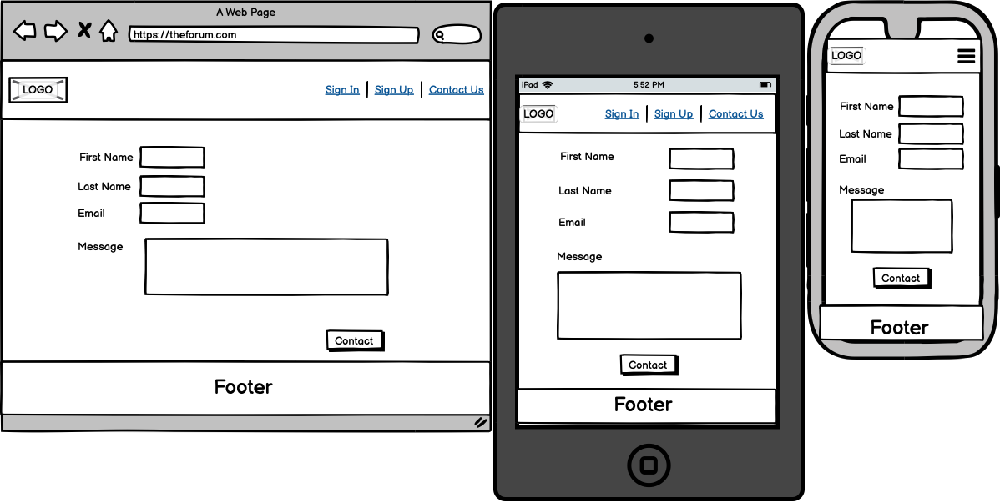
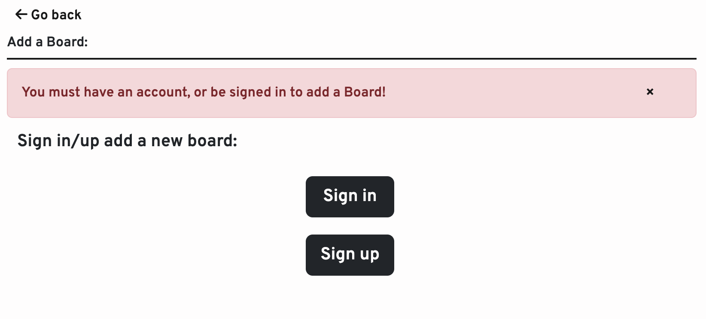
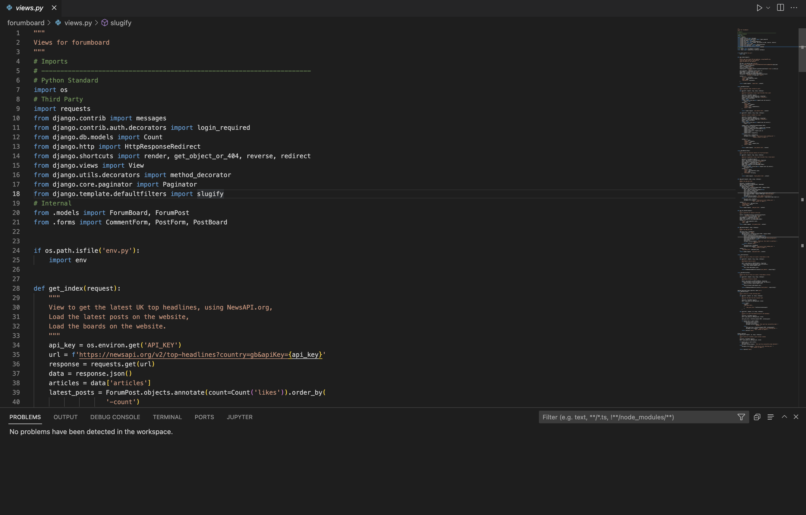
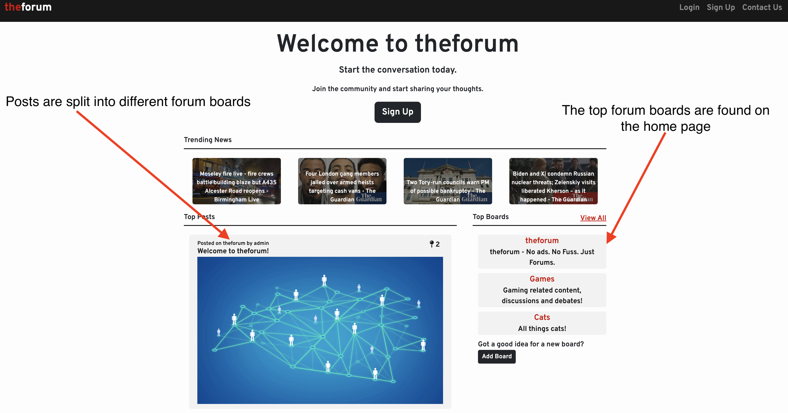

# theforum - No ads. No Fuss. Just Forums.
Developed by, [Dan Pearce](https://danpearce.software/)

[View the live application](https://ci-pp4-theforum-danpearce.herokuapp.com/)

theforum is exacty what it says it is on the tin, a website designed for any and whatever topics our users would like to discuss! The site is deliberately left as a broad discussion board, to attract just about anyone who has something to say.

Users are able to create their own ForumPost, comment on any post, and create their own ForumBoard. This allows the users to have a free discussion on their chosen topic. 

"theforum - No ads. No Fuss. Just Forums."

## Contents
1. [Application Goals and User Experience](#application-goals-and-user-experience)
    - [User Goals](#user-goals)
    - [Owner Goals](#owner-goals)
    - [Target Audience](#target-audience)
    - [User Expectations](#user-expectations)
    - [User Manual](#user-manual)
2. [User Stories](#user-stories)
    - [User](#user)
    - [Owner](#owner)
3. [Design](#design)
    - [Structure](#structure)
    - [Database and Models](#database-and-models)
    - [Wireframes](#wireframes)
    - [Colour](#colour)
4. [Main Features](#main-features)
5. [Technologies](#technologies)
    - [Languages](#languages)
    - [APIs](#apis)
    - [Libraries, Frameworks and Other Technologies](#libraries-frameworks-and-other-technologies)
6. [Validation and Testing](#validation-and-testing)
    - [Python PEP8 Testing](#python-pep8-testing)
    - [HTML Validation](#html-validation)
    - [CSS Validation](#css-validation)
    - [Accessibility Validation](#accessibility-validation)
    - [Performance Validation](#performance-validation)
    - [Device and Browser Compatibility](#device-and-browser-compatibility)
    - [User Story Testing](#user-story-testing)
7. [Bugs and Errors](#bugs-and-errors)
8. [Deployment](#deployment)
9. [Credits](#credits)
10. [Acknowledgements](#acknowledgements)

## Application Goals and User Experience

### User Goals
- Easily navigate thoughout the website with ease.
- Easily distinguish if logged in, use the site in all states.
- Use theforum to create content and discussions.
- Get in touch with the administrative team, regarding reporting a post or anything else.

### Owner Goals
- Provide the user feedback while using the site.
- Provide the user and experience that is responsive.
- Provide the user with a point of contact for submitting a report or getting in touch in general.

### Target Audience
- Lovers of debates/conversations about any topic they wish to talk about.
- Users that would like to catch up on the latest news.
- People who like to voice their opinion.

### User Expectations
- Experience use of the site on all devices, with a fully responsive experience.
- While navigating throughout the site, always able to understand where they are and how to get back.
- An interactive and engaging user interface that is easy to use.
- All links to be fully functioning and working throughout the site.

## User Stories
### User
1. Trending Home Page
    - As a Consumer I can view a list of trending posts so that I can select the one I’d prefer to read.
2. Categorisation of Posts
    - As a Consumer, I can view, and navigate through different Forum Boards and posts, so that I can find the topics/hobbies that I’d like to read.
3. Likes on a Post
    - As a Consumer, I can view the number of likes a post has received, so that I can clearly see which post is the most popular.
4. Opening a Post
    - As a Consumer, I can open a post so that I can read its contents.
5. Viewing Comments
    - As a Consumer, I can see the comments on a post, so that I can gather other’s opinions on the topic. 
6. Account Creation
    - As a Consumer, I can create an account, so that I can use more features of the site.
7. Liking of Posts
    - As a Consumer I can like existing posts, so that I can help to increase its popularity/trending status.
8. Editing Posts
    - As a Consumer, I can make changes to my existing posts, so that I can rectify any errors I may have made while creating the original post.
9. Deleting Posts
    - As a Consumer, I can delete any of my existing posts, so that I can chose to take said post down for whatever reason.
10. Creating a Board
    - As a Consumer, I can create a Forum Board, so that I can create a sub-community for said topic/hobby.
11. Following Boards
    - As a Consumer, I can follow a Forum Board, so that I can help to increase its popularity/trending status.
12. Creating a Post
    - As a Consumer, I can create a post, so that I can engage and start a conversation with my chosen Forum Board.
13. Commenting on Posts
    - As a Consumer, I can comment on existing posts, so that I can add my input to an existing post/conversation.
14. Reporting Posts
    - As a Consumer, I can report a post, so that I can help to keep the community a safe place.
15. Contact Us
    - As a Consumer, I can get in touch with the administrative team, so that I can make suggestions or submit bugs.

### Owner
16. Admin Moderator
    - As an Admin/Owner, I can create, read, edit, like, and delete existing boards, posts, and comments, so that I can manage the content posted on the site.
17. Responsive Site
    - As an Owner, I can provide a fully responsive experience, so that my users can visit the website on any device they wish.
18. User Feedback
    - As an Owner, I can to provide my users with feedback, so that they can distinguish if their action was successful. 
19. Content Control
    - As and Owner, I can ensure only users with accounts to be able to create content, so that some form of moderation can be used if needed. 

## Design

### Structure
The physical structure of the website is built using Django. I have built in mind of using databases and using that to fill the content of the site. As the site is very user driven this allows users to effectivetly create their own content and fill the space with the content they wish.

The structute of the site is designed with ease of use in mind, allowing users to easily navigate throughout the site and to recognise where they are. Each page on the site is similar in order to allow the user to pick up the navigation easily.

The site sturcute is as followed:
- 'base.html'
    - Provides the base page sturcture, header, footer, key navigation.
- 'account_logout' [Django All Auth]
    - Provides the user with an area to log out of their account.
- 'account_login' [Django All Auth]
    - Provides the user with an area to log into of their account.
- 'account_signup' [Django All Auth]
    - Provides the user with an area to create and account.
- 'contact.html'
    - Provides the user with a form to which they can send the owner/admin a message.
- 'index.html'
    - Provides the user with the key content of the site, featuring the top stories, top posts and top boards.
- 'latest_posts.html'
    - Provides the content for top posts directly into index html, paginating by 5 to prevent over loaded information.
- 'top_boards.html'
    - Provides the content for top boards directly into index html, paginating by 10 to prevent over loaded information.
- 'all_boards.html'
    - Provides the users a list of all the boards, paginating by 20 to prevent over loaded information.
- 'add_board.html'
    - Provides the user a form to which they can enter some content in order to submit a board for approval.
- 'board_header.html'
    - Provides all pages releting to the board in question, with header that includes the boards image and also the boards title.
- 'post_detail.html'
    - Provides the key information from the database and displays the selected post's information to the user.
- 'edit_post.html'
    - Provides the user who created the post a form to edit their existing post.
- 'board_detail.html'
    - Provides the key information from the database and displays the selected boards's information to the user.
- 'add_post.html'
    - Provides the user a form to which they can use to create a post on their selected board.

### Database and Models
#### Database
This project was built using a relational database allowing us to easily link aspects of the site with others.

During development, I used [DB SQLite which](https://www.sqlite.org/) which is the default database to use for Django - and for production [ElephantSQL](https://www.elephantsql.com/) has been used and all data migrated during the deployment. 

Diagram

#### Models
All models used/created in this project have been used to recreate the model strucure illustrated above.

1. ForumBoard
    - Fields (id, name, slug, created_on, about, board_background, followers, approved_board)
    - The id shares with ForumPost a One to Many relationship as the board can contain unlimited posts.
    - followers shares a many to many field with all users, to allow us to count how many people are interested in the topic.

2. ForumPost
    - Fields (id, forum_board, post_title, slug, creator, featured_image, post_detail, excerpt, created_on, likes)
    - The ForumPost shares a Many to One relationship with ForumBoard
    - The id of ForumPost shares with Comment a One to Many relationship as the the post can contain unlimited comments.
    - likes shares a many to many field with all users, to allow us to count how many people are interested in the post.
    - creator shares a One to One relationship with the AllAuth User 

3. Comment
    - Fields (id, post, creator, body, comment_likes)
    - Comment shares a One to Many relationship with ForumPost.
    - comment_likes shares a many to many field with all users, to allow us to count how many people are interested in the comment.
    - creator shares a One to One relationship with the AllAuth User 

4. User - Django All Auth
    - The user model is part of the allauth library and is used for information relating to our user.
    - id shares a One to One relationship with both ForumPost and Comment.

5. Contact
    - Fields (id, first_name, last_name, email, body, created_on)
    - This is a stand alone model used to gather details from the contact form, as this doesn't require a user to be signed in this doens't have any relations. 

### Wireframes

base

index

board_detail

post_detail

add_board

add_post

contact

### Fonts and Icons
#### Fonts
The main font used throughout the website is [Overpass](https://fonts.google.com/specimen/Overpass), I chose this whilst designing the logo. As I wanted to use a font that felt natural and joined the words 'theforum' easily, I landed on this font as I felt this was achieved.

The other font used is [Nunito](https://fonts.google.com/specimen/Nunito) and this is simply to make the footer fonts stand out and be seperated from the main site. 

#### Icons
I used [favicon.io](https://favicon.io/) to create the favicon icons for the site.

Icons from [Font Awesome](https://fontawesome.com/) we're also used throughout the site.

### Colour
The colours I have used provide the site with a clean and modern look - with the use of colours that deliberatly contrast in order to make the site stand apart from its peers and to also ensure that the site is easily viewable by all.

The colours have also been chosen to provide a memberable site to the end user, and I delibertaely went with a red colour as this site is least used amongst the social media platforms.

Please find the colours in the pallete below, created by using [Coolors.co](https://coolors.co/)

Palette

### Main Features
The features of this website are combined to create an interactive user experience that engages the audience to create their own content and to interact with others.

#### Trending Home Page

When a user logs onto the home page of the forum, regardless of if they have an account or not, they are met with the latest news provided from [NewsAPI](https://newsapi.org/), met with the most popular posts on the site and are also able to navigate to the most followed boards of the site.

The structure of the site has been made to make the home page the place to view the most popular information.

- User Story Testing: 1, 3, 7, 11

Trending Home Page

Top Stories

Top Posts

Top Boards

#### Forum Boards
theforum features the ability to create and add ForumBoard's onto the site, this allows our users to create communities for any topic they wish - this also allows the site users to generate their own content.

- User Story Testing: 2, 3

All Forum Boards

Forum Board Detail

#### Account Creation
Django All Auth has been used to allow the creation of user accounts, this allows us to allow users who do have an account to access more features of the site, such as creating a post.

- User Story Testing: 6

Account Creation

#### Creation of Posts and Boards
theforum sets out to allow its users to create its own content, our users are able to create a ForumBoard and as soon as this has been approved this will be live on the site for all to interact with.

Users are also able to comment on any post they'd like as long as they have an account, this promotes discussion on the site.

- User Story Testing: 10, 12

Add Board

Add Board(2)

Add Post

Add Post(2)

#### Post Modification
I have implemented the ability for the creator of a post to edit/delete their own content. This allows the creator to have more control over their posts and make changes should they need to do so.

- User Story Testing: 8, 9

Edit Post

Edit Post(2)

Delete Post

Delete Post(2)

#### Interactivity with Posts & Boards
All users with an account have the ability to interact with all Posts and Boards.

##### Boards
Users are able to open up each ForumBoard that has been approved by the administrator, and are able to view the latst ForumPosts that have been posted on that board. Each user is also able to 'follow' the board, moving its rank up on the home page's 'top boards' section.

##### Posts
Users are also able to open each Post that has been posted to any board, which will contain its title, creator, featured image, date of creation and also the main content of the post.

They are also able to like each individul post from the post's detail page - this will move the posts popularity up on the home page. They can view the likes on the post in the top right hand corner of the post.

Each post is also joined with its own set of comments that relate to the post, these are displayed below the main content for all to see. Users are also able to add a comment if they wish which will be displayed at the top in reverse posted order.

- User Story Testing: 3, 4, 5, 7, 11, 13

Forum Board Detail

Post Detail

Add Comment

View Comments

Liking Post

Viewing Post Like

Viewing Post Like(2)

Follow Board

Follow Board(2)

#### Getting in Touch
Users are able to get in touch with the site owner and administrators. They can click the 'Report Post' button underneath each indivodual post which will redirect them to the contact us page - where the user can describe their problem to the admins. The users are also able to press the contact us button at all times through the navigation menu, they can use this to report again or they can get in touch with any general questions too.

- User Story Testing: 14, 15

Report Post

Contact Us

#### Responsive Experience
The site is fully responsive and will change its appearance depending on the device that it is being viewed on. 

The site also provides a responsive experience, by providing the users feedback based on their actions on the site.

- User Story Testing: 17, 18

Responsive Site

Responsive Site(2)

User Feedback

User Feedback(2)

#### Content Control
theforum only allows users with an account to post onto the site, allowing moderation to be kept in place helping to keep the community a safe place for all.

- User Story Testing: 19

Content Control

Content Control(2)

Content Control(3)

Content Control(4)

#### Administrative Control
The administrative team are able to log onto their admin console, from here they are able to manage all user accounts, boards, posts and comments in order to keep the community safe.

- User Story Testing: 16

Administrative Control

Administrative Control(2)

Administrative Control(3)

## Technologies

### Languages
- [HTML](https://en.wikipedia.org/wiki/HTML5)
- [CSS](https://en.wikipedia.org/wiki/CSS)
- [JavaScript](https://en.wikipedia.org/wiki/JavaScript)
- [Python](https://www.python.org/)
- [Django](https://www.djangoproject.com/)

### APIs
I used [NewsAPI](https://newsapi.org/) within this project, which allows developers a free plan for personal projects. The use of this API can be found on the home page and provides us updated content for the 'top stories' section.

### Libraries, Frameworks and Other Technologies
- [Boostrap](https://getbootstrap.com/) - Used to enhance my CSS code.
- [jQuery](https://jquery.com) - Used to make the use of my JavaScript code more simplified.
- [Django](https://www.djangoproject.com) - Used to form the project, this project is mainly a Django based project - Many built in libraries have also been used to enhance the project.
- [Git](https://git-scm.com/) - Used to implement version control within the project.
- [GitHub](https://github.com/) Used to host my code.
- [GitPod](https://www.gitpod.io/) Used to build my code online.
- [VS Code](https://code.visualstudio.com) - Used occasionally to build the code offline.
- [Heroku](https://dashboard.heroku.com/) - Used to host the live version of the site.
- [DB SQLite](https://www.sqlite.org/index.html) - Used to create the database on the development version of the site.
- [ElephantSQL](https://www.elephantsql.com/) - Used to host the database for the live site.
- [Font Awesome](https://fontawesome.com/) - Used for the icons shown on the site.
- [Balsamiq](https://balsamiq.com/) - Used to create the Wireframes for the site.
- [Lucid Chart](https://www.lucidchart.com/) - Used to create the diagrams used for the models.
- [Google Chrome Developer Tools](https://developers.google.com/web/tools/chrome-devtools) - Used for day-to-day testing and configuration of the site.
- [Google Fonts](https://fonts.google.com/) - Used for the two fonts featured on the site [Fonts](#fonts).
- [Favicon.io](https://favicon.io/) - Used to create the favicon featured on the site.
- [Am I Responsive? - ui.dev](https://ui.dev/amiresponsive) - Used to create the responsive images for the site.
- [Cloudinary](https://cloudinary.com/) - Used to host the images used on the live site.
- [Summernote](https://summernote.org/) - Used to enhance some text fields on the site.
- Validation:
    - [WC3 Markup Validation Serivce](https://validator.w3.org/) - Used to validate the HTML.
    - [W3C Jigsaw Validation Service](https://jigsaw.w3.org/css-validator/) - Used to validate the CSS.
    - [JSHint](JSHint) - Used to validate the JS.
    - [PyCodeStyle](https://pypi.org/project/pycodestyle/) - Used to validate the Python code.
    - [WAVE - Web Accessibility Evaluation Tool](https://wave.webaim.org/) - Use to ensure the site is accessibile to all.
    - [Lighthouse](https://developers.google.com/web/tools/lighthouse) - Used to check performance of the site.

## Validation and Testing

### PyCodeStyle Validation
All Python Code has been checked using the [PyCodeStyle](https://pypi.org/project/pycodestyle/) library. All code has been returned with no errors.

admin.py

apps.py

forms.py

models.py

tests.py

urls.py

views.py

forumboard

admin.py

apps.py

forms.py

models.py

tests.py

urls.py

views.py

### HTML Validation
The HTML has been tested using the [W3C Markup Validation Service](https://validator.w3.org/) in order validate the correct function of this site. All pages have passed with no errors or warnings.

add_board.html

add_post.html

all_boards.html

board_detail.html

contact.html

edit_post.html

index.html

login.html

logout.html

post_detail.html

signup.html

### CSS Validation
The [W3C Jigsaw Validation Service](https://jigsaw.w3.org/css-validator/) has been used to test the CSS of this website. The CSS has passed with no errors.

style.css

### JavaScript Validation
[JSHint](https://jshint.com/) was used to test the JavaScript of this site and all js files have passed with no errors.

script.js

### Accessibility Validation
The [WAVE - Web Accessibility Evaluation Tool](https://wave.webaim.org/) was used to test the accessibility function of the website, all pages have passed with no errors. Some warnings are present, however this is due to header styling which has been done on purpose to fit the design.

add_board.html

add_post.html

all_boards.html

board_detail.html

contact.html

edit_post.html

index.html

login.html

logout.html

post_detail.html

signup.html

### Performance Validation
[Lighthouse](https://developers.google.com/web/tools/lighthouse) in the Google Chrome Developer Tools was used to test the performance of the website and all pages have passed with a green score.

add_board.html

add_post.html

all_boards.html

board_detail.html

contact.html

edit_post.html

index.html

login.html

logout.html

post_detail.html

signup.html

### Device and Browser Compatibility
The project has been tested on numerous devices all of which result with full functionality and no visual issues the devices I tested on were as followed:
- MacBook Pro 16-inch 
- Desktop PC with 32-inch screen.
- iPhone 12 Pro
- iPad Pro 11inch
- Microsoft Surface Pro 3
- This site was also tested on all default Google Chrome Developer Tool screen sizes.

#### Browser Compatibility
The project was tested and viewed on the following browsers with no errors:
- [Google Chrome](https://en.wikipedia.org/wiki/Google_Chrome)
- [Mozilla Firefox](https://en.wikipedia.org/wiki/Firefox)
- [Microsoft Edge](https://en.wikipedia.org/wiki/Microsoft_Edge)
- [Apple Safari](https://en.wikipedia.org/wiki/Safari_(web_browser))

### User Story Testing
| **User Story 1** | **User Action** | **Desired Outcome** | **Actual Outcome** |
|------------------|-----------------|---------------------|--------------------|
| As a Consumer I can view a list of trending posts so that I can select the one I’d prefer to read. | User opens the site at the home page. | The user can view a list of posts, based on their popularity. | Works as intended. |
| 

 | | | |

| **User Story 2** | **User Action** | **Desired Outcome** | **Actual Outcome** |
|------------------|-----------------|---------------------|--------------------|
| As a Consumer, I can view, and navigate through different Forum Boards and posts, so that I can find the topics/hobbies that I’d like to read. | User uses the UI to find the content they wish. | The user can use the top boards to a board they resonate with, they can then search through its posts. | Works as intended. |
| 

 | | | |
| 

 | | | |

| **User Story 3** | **User Action** | **Desired Outcome** | **Actual Outcome** |
|------------------|-----------------|---------------------|--------------------|
| As a Consumer, I can view the number of likes a post has received, so that I can clearly see which post is the most popular. | User navigates to any post, through any way possible. | The user is clearly able to see how many likes a post has recieved. | Works as intended. |
| 

 | | | |
| 

 | | | |

| **User Story 4** | **User Action** | **Desired Outcome** | **Actual Outcome** |
|------------------|-----------------|---------------------|--------------------|
| As a Consumer, I can open a post so that I can read its contents. | The user clicks a post from any of the possible routes. | The post opens up fully and allows the user to read its full contents. | Works as intended. |
| 

 | | | |

| **User Story 5** | **User Action** | **Desired Outcome** | **Actual Outcome** |
|------------------|-----------------|---------------------|--------------------|
| As a Consumer, I can see the comments on a post, so that I can gather other’s opinions on the topic. | The user naviagtes to a post, and scrolls to the bottom of the page to view the 'Comments' section. | The comments on the post are clearly visbible to the user. | Works as intended. |
| 

 | | | |

| **User Story 6** | **User Action** | **Desired Outcome** | **Actual Outcome** |
|------------------|-----------------|---------------------|--------------------|
| As a Consumer, I can create an account, so that I can use more features of the site. | User naviagtes to the 'Sign Up' section in the Nav Bar, and clicks the link. | Easily sign up with no hassle, Once signed up the user can use more featues of the site. | Works as intended. | 
| 

 | | | |

| **User Story 7** | **User Action** | **Desired Outcome** | **Actual Outcome** |
|------------------|-----------------|---------------------|--------------------|
| As a Consumer I can like existing posts, so that I can help to increase its popularity/trending status. | User to navigate to the post's page, and then click the heart icon. | The post will climb in ranking on the home page. | Works as intended. |
| 

 | | | |

| **User Story 8** | **User Action** | **Desired Outcome** | **Actual Outcome** |
|------------------|-----------------|---------------------|--------------------|
| As a Consumer, I can make changes to my existing posts, so that I can rectify any errors I may have made while creating the original post. | User who created the post, clicks 'Edit Post' under the post's description, and clicks the link. | The user is then able to make the necessary adjustments and edits to the post. | Works as intended. |
| 

 | | | |
| 

 | | | |

| **User Story 9** | **User Action** | **Desired Outcome** | **Actual Outcome** |
|------------------|-----------------|---------------------|--------------------|
| As a Consumer, I can delete any of my existing posts, so that I can chose to take said post down for whatever reason. | Creator of the post navigates to the 'Delete Post' button underneath the description, and clicks the link. | The user is prompted with a message to ensure they want to delete, after confirming the post is deleted. | Works as intended. |
| 

 | | | |
| 

 | | | |

| **User Story 10** | **User Action** | **Desired Outcome** | **Actual Outcome** |
|-------------------|-----------------|---------------------|--------------------|
| As a Consumer, I can create a Forum Board, so that I can create a sub-community for said topic/hobby. | Users navigate to the 'Add Board' button on the home page, and clicks the link. | Users are presented with a form to fill in to create a board. | Works as intended. |
| 

 | | | |
| 

 | | | |

| **User Story 11** | **User Action** | **Desired Outcome** | **Actual Outcome** |
|-------------------|-----------------|---------------------|--------------------|
| As a Consumer, I can follow a Forum Board, so that I can help to increase its popularity/trending status. | User clicks the follow icon. | The forum board increases by a follower, also moving it up on the top boards section. | Works as intended. |
| 

 | | | |
| 

 | | | |
| 

 | | | |

| **User Story 12** | **User Action** | **Desired Outcome** | **Actual Outcome** |
|-------------------|-----------------|---------------------|--------------------|
| As a Consumer, I can create a post, so that I can engage and start a conversation with my chosen Forum Board. | From the board detail page, the user navigates to the 'Add Post' section, and clicks the link. | The user is presented with a form to fill asking them for content to fill in about the post. | Works as intended. |
| 

 | | | |
| 

 | | | |

| **User Story 13** | **User Action** | **Desired Outcome** | **Actual Outcome** |
|-------------------|-----------------|---------------------|--------------------|
| As a Consumer, I can comment on existing posts, so that I can add my input to an existing post/conversation. | User navigates to any post, scrolling down just under the post's description, they are able to add a 'Comment'. | The comment is displayed, showing engagement from the user. | Works as intended. |
| 

 | | | |
| 

 | | | |

| **User Story 14** | **User Action** | **Desired Outcome** | **Actual Outcome** |
|-------------------|-----------------|---------------------|--------------------|
| As a Consumer, I can report a post, so that I can help to keep the community a safe place. | Navigate to the post they wish to report, under this they can select 'Report Post'. | The user is presented with a form to fill where they can make a complaint about a post. | Works as intended. |
| 

 | | | |
| 

 | | | |

| **User Story 15** | **User Action** | **Desired Outcome** | **Actual Outcome** |
|-------------------|-----------------|---------------------|--------------------|
| As a Consumer, I can get in touch with the administrative team, so that I can make suggestions or submit bugs. | User navigates to the nav bar and clicks 'Contact Us' link. | User is brought to a form to which they can fill out to get in touch with the owner/admin. | Works as intended. |
| 

 | | | |
| 

 | | | |

| **User Story 16** | **User Action** | **Desired Outcome** | **Actual Outcome** |
|-------------------|-----------------|---------------------|--------------------|
| As an Admin/Owner, I can create, read, edit, like, and delete existing boards, posts, and comments, so that I can manage the content posted on the site. | The administrator navigates to the 'admin' panel. | The admin is able to used the console to make changes, add or delete content as needed. | Works as intended. |
| 

 | | | |
| 

 | | | |
| 

 | | | |

| **User Story 17** | **User Action** | **Desired Outcome** | **Actual Outcome** |
|-------------------|-----------------|---------------------|--------------------|
| As an Owner, I can provide a fully responsive experience, so that my users can visit the website on any device they wish. | The user navigates to the site, on any page. | The site remains visible and usable regardless of where it is being viewed. | Works as intended. |
| 

 | | | |
| 

 | | | |

| **User Story 18** | **User Action** | **Desired Outcome** | **Actual Outcome** |
|-------------------|-----------------|---------------------|--------------------|
| As an Owner, I can to provide my users with feedback, so that they can distinguish if their action was successful. | User creates some content, uses user authentication, or makes an error. | The user is prompted with a message to inform them of their action. | Works as intended. |
| 

 | | | |
| 

 | | | |
| 

 | | | |

| **User Story 19** | **User Action** | **Desired Outcome** | **Actual Outcome** |
|-------------------|-----------------|---------------------|--------------------|
| As and Owner, I can ensure only users with accounts to be able to create content, so that some form of moderation can be used if needed. | User navigates to any form of content creation page. | If the user is signed in they can continue, if they are not they are unable to do so and are prompted to sign in or sign up. | Works as intended. |
| 

 | | | |
| 

 | | | |
| 

 | | | |

## Bugs and Errors
| **Bug/Error** | **Resolution** |
|---------------|----------------|
| News Catcher API - Intially I wanted to use the News Catcher API to implement the top stories, however as I could not get an increased request rate this resulted in errors as the items could not be displayed after about 5 requests. | To resolve this issue I decided to move to NewsAPI.org which offered a much higher request rate per day for projects in developent |
| HTML Code Initially wasn't validated due to mainly indenting errors and ending divs missing, there were also so images without an alt tag | Made the necessary adjustments by looking at the live source code and making the changes needed to ensure the document was validated. |
| In my initial testing of edit_post I was unable to figure out how to edit an existing post and have this detail shown to the user | After some reasearch I figured out you must inlude 'instance' in the request in order to populate the fields |

## Deployment

## Credits

## Acknowledgements